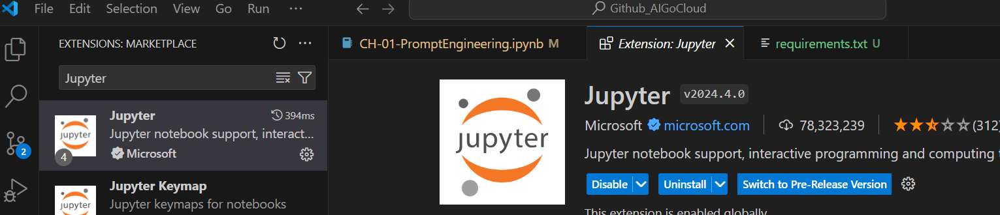

# Challenge 0: Pre-requisites - Set up IDE and Azure resources

**[Home](../README.md)** - [Next Challenge >](./Challenge-01.md)

## Introduction

The first challenge is to prepare the local development environment in VSCode and able to access to Azure Portal and and setup necessary Azure services.

## Pre-requisite
1. Install Visual Studio Code v1.8x - [Download link](https://code.visualstudio.com/download)
2. Install Git v2.4x - [Download link](https://git-scm.com/downloads)
3. Install Python v3.12.3 - [Download link](https://www.python.org/downloads/)
4. Azure Subscription - [Request free subscription for students](https://azure.microsoft.com/en-us/free/students)

> :memo: **Note:** If you have issue to request new a free Azure subscription, don't worry. We will provide neccessary details to finish this workshop.

## Description
First, we need to setup local development environment to run Jupyter Notebook. We will use VSCode for this workshop.

1. Clone [Bootcathon - GenAI Github repo](https://github.com/ekgapark/Bootcathon-GenAI) to your VSCode.
2. Seach for Jupyter plugin in VSCode extension and install it.

3. Open Terminal in VSCode, navigate to `Notebooks` folder, then Install all required Python libraries by run this command in VSCode terminal `pip install -r requirements.txt`. You should see it downloads the packages and install on your machine.
4. Close VSCode and reopen the program again.

> :memo: **Note:** If you don't have Azure subscription, please proceed to the [next challenge](./Challenge-01.md)

Next, we'll be setting up all Azure AI services we will need to complete our challenges.

1. Login to the Azure Portal (https://portal.azure.com)
2. Create Azure Document Intelligence 
    - Region: `EastUS`
    - Name: `bootcathon-<your name>-di`
    - Pricing tier: `Standard S0`
    - Note: other resources will be used at same location.
3. Create Azure AI Search 
    - Name: `bootcathon-<your name>-search`
    - Pricing tire: Change to `Basic`
4. Create Azure Storage Account
    - Name: `bootcathon<your name>sa`
    - Redundancy: `Locally-redundant storage (LRS)`
 
## Success Criteria

1. You have Jupyter plugin installed in VSCode.
2. You have installed all Python libraries.
3. You have provisioned Azure Document Intelligence, Azure AI Search and Azure Storage account.

## Learning Resources

- [Get start with Azure Document Intelligence SDK](https://learn.microsoft.com/en-us/azure/ai-services/document-intelligence/quickstarts/get-started-sdks-rest-api?view=doc-intel-4.0.0&pivots=programming-language-python)
- [Get start with Azure AI Search SDK](https://learn.microsoft.com/en-us/azure/search/search-get-started-rest)
- [Introduction to Azure Blob Storage](https://learn.microsoft.com/en-us/azure/storage/blobs/storage-blobs-introduction)

**[Home](../README.md)** - [Next Challenge >](./Challenge-01.md)
