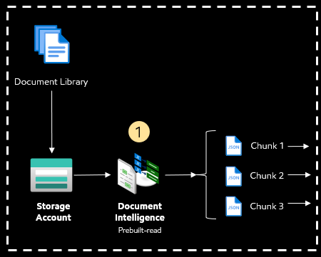
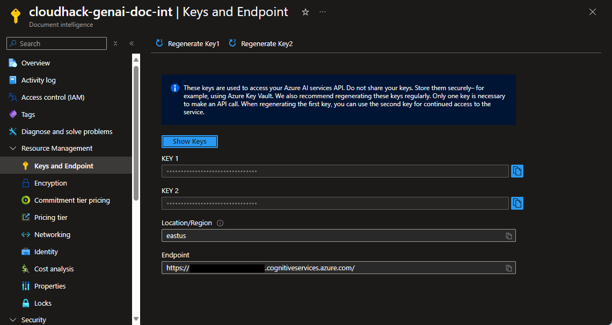

# Challenge 1: Explore Document Parsing and Chunking

[< Previous Challenge](./Challenge-00.md) - **[Home](../README.md)** - [Next Challenge >](./Challenge-02.md)

## Pre-requisites

- Azure Document Intelligence and Azure Storage Account
- Install the required libraries in the `requirements.txt` file via `pip install -r requirements.txt` if you have not already.

## Introduction

In this challenge, you will upload PDF documents to blob storage and learn how to use Document Intelligence to parse the document to JSON, then you will chunk the JSON into smaller document chunks.

Azure Document Intelligence is a cloud-based AI service that automates the extraction of text, key-value pairs, tables, and structures from documents. It’s important for Retrieval-Augmented Generation (RAG) because it parses the PDF documents into LLM friendly format such as JSON or Mark down.

Chunking the output before embeddings is crucial because it defines the unit of information for retrieval, optimizing storage and reducing latency in vector databases. It also balances contextual richness with retrieval precision, preventing hallucinations in LLMs and ensuring coherent and accurate content generation.

## Description

> :memo: **Note:** If you don't have Azure subscription, please obtain the **credential.env** file from the instructor.

1. Navigate to Azure Document Intelligence and copy the `document intelligent endpoint` and the `key1`.
   
2. Update `AZURE_DOCUMENT_INTELLIGENCE_ENDPOINT` and 
`AZURE_DOCUMENT_INTELLIGENCE_KEY` parameters in `credential.env` file.
1. Naviate to Azure storage account and copy the connection string and the key.
2. Update `AZURE_BLOB_STORAGE_ACCOUNT_NAME`, `AZURE_BLOB_STORAGE_KEY` and `AZURE_BLOB_STORAGE_CONNECTION_STRING` parameters in `credential.env` file.
3. Update `AZURE_BLOB_CONTAINER_NAME` to `bootcathon-<your name>-container`
4. Open [CH-01-Document-Preprocess.ipynb](../Notebooks/CH-01-Document-Preprocess.ipynb) Jupyter Notebook under `/Notebooks` and follow the instruction in the Notebook.

## Success Criteria

1. PDF documents are parsed to JSON format successfully.
2. JSON outputs are chunked to smaller pieces.

## Learning Resources

- [Azure Document Intelligence - Read model](https://learn.microsoft.com/en-us/azure/ai-services/document-intelligence/concept-read?view=doc-intel-4.0.0&tabs=sample-code)
- [What is chunking?](https://www.rungalileo.io/blog/mastering-rag-advanced-chunking-techniques-for-llm-applications)

[< Previous Challenge](./Challenge-00.md) - **[Home](../README.md)** - [Next Challenge >](./Challenge-02.md)