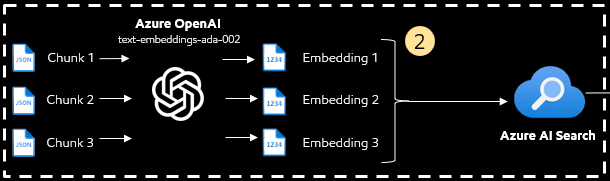
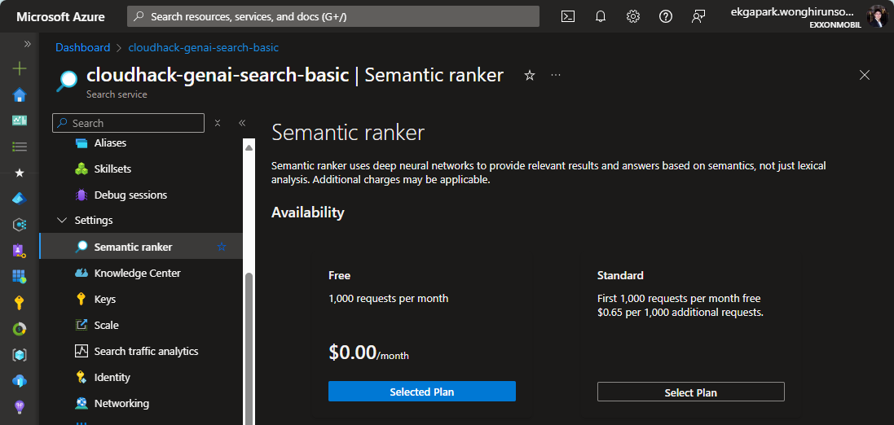
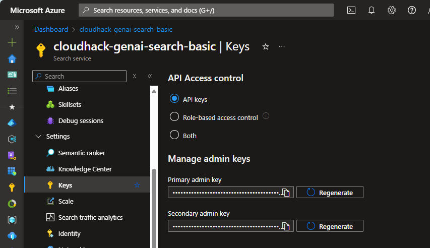

# Challenge 2: Embedding chunks, create Azure AI search index

[< Previous Challenge](./Challenge-01.md) - **[Home](../README.md)** - [Next Challenge >](./Challenge-03.md)

## Introduction

In this challenge, you will need to use Azure OpenAI embedding model to add vector content of each chunked documents in JSON format before uploading to Azure AI Search which is a vector database. You will learn how to use Azure AI Search SDK to create an index profile and upload documents to it.

Azure AI Search is an AI-powered information retrieval platform designed to help developers create sophisticated search experiences and generative AI applications. It combines large language models with enterprise data, offering advanced deep-learning models, semantic search, and customizable AI integrations.

In the context of Retrieval-Augmented Generation (RAG) applications, Azure AI Search acts as a critical component by providing an information retrieval system that supplies grounding data to a Large Language Model (LLM) like GPT4o. This integration allows the LLM to generate responses that are informed by up-to-date and relevant enterprise content, enhancing the accuracy and quality of the application. Essentially, it enables the LLM to chat with documents, generate engaging content, and leverage the power of Azure OpenAI models for data-driven insights.

## Description

> :memo: **Note:** If you don't have Azure subscription, please obtain the **credential.env** file from the instructor.

1. Navigate to Azure AI Search, under `Setting -> Semantic ranker`, select `Free` plan.
   
2. In Azure AI Search, copy the `Azure AI search URL` and the `Primary admin key`.
   
3. Update `AZURE_AI_SEARCH_ENDPOINT` and 
`AZURE_AI_SEARCH_KEY` parameters in `credential.env` file.
4. Update `AZURE_AI_SEARCH_INDEX_NAME` to `cloudhack-<your name>-index`
5. Contact the Coach to get `AZURE_OPENAI_API_KEY` and update in `credential.env` file.
2. Open [CH-02-Document-Embedding.ipynb](../Notebooks/CH-02-Document-Embedding.ipynb) Jupyter Notebook under `/Notebooks` and follow the instruction in the Notebook.

## Success Criteria

1. Successfully create Azure AI Search index.
2. All vector content of chunked documents are uploaded to Azure AI Search index.

## Learning Resources

- [Azure AI Search Overview](https://learn.microsoft.com/en-us/azure/search/search-what-is-azure-search)
- [What is embeddings?](https://www.rungalileo.io/blog/mastering-rag-how-to-select-an-embedding-model)

[< Previous Challenge](./Challenge-01.md) - **[Home](../README.md)** - [Next Challenge >](./Challenge-03.md)

