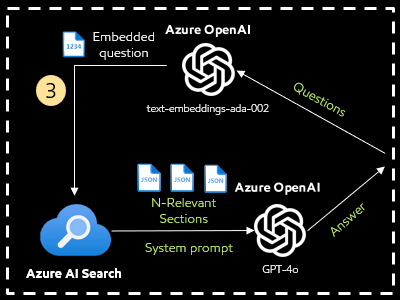

# Challenge 3: Retrieve search output and interact with Azure OpenAI

[< Previous Challenge](./Challenge-02.md) - **[Home](../README.md)** - [Next Challenge >](./Challenge-04.md)

## Introduction

In this challenge, you will explore 2 tasks. First, explore different search techniques using Azure AI Search to retreive most relavant chunked of documents. Second, use the Azure OpenAI chat model (GPT3.5_Turbo, GPT4_Turbo and GPT4o) to generate an answers based on retrieved documents.

### Using different search techniques in Azure AI Search is crucial when building Retrieval-Augmented Generation (RAG) applications. Here’s why:

- Pre-retrieval Optimization: Techniques like query rewriting and routing help refine user input, ensuring that the search system understands the user’s intent and retrieves the most relevant data. This step is essential for improving the quality of the data that the RAG system will use.
- Advanced Retrieval Techniques: Azure AI Search supports advanced retrieval methods such as hybrid search and semantic ranking. These techniques are vital for finding the most relevant information from a vast dataset, which is then used to generate accurate and contextually appropriate responses.
- Post-retrieval Enhancement: After retrieving the information, it’s important to optimize the data for the LLM’s consumption. This might involve summarizing or reformatting the data to fit the LLM’s input requirements.
- Relevance and Quality: The retrieval system’s ability to return highly relevant results directly impacts the quality of the LLM’s outputs. The better the input data, the more relevant and useful the generated content will be.

## Description

1. Navigate to folder [pdf_document](../Notebooks/pdf_document/) and review sample documents.
2. Create few questions based on the documents. You will use as test questions in this challenges. For example,
   1. What is GenAI?
   2. GenAI คืออะไร
   3. What are recommendations when using GenAI?
   4. What are the trends of GenAI?
   5. What are examples of GenAI applications?
3. Open [CH-03-Document-Retrieval.ipynb](../Notebooks/CH-03-Document-Retrieval.ipynb) Jupyter Notebook under `/Notebooks` and follow the instruction in the Notebook.
4. Use different search techniques based on your questions and compare the output agaist each technique.
   1. Vector similarity search
   2. Vector similarity search with multi-lingual
   3. Hybrid search
   4. Semantic Hybrid Search with reranker
5. Use `Semantic Hybrid Search with reranker` to retrieve documents based on your test questions, then send them to Azure OpenAI Chat Models (GPT3.5_Turbo, GPT4_Turbo and GPT4o) to generate the answer.
  
## Success Criteria

1. Successfully retrieve documents based on different search techniques.
2. Successfully call Azure OpenAI API to generate the answer based on retrieved documents.

## Learning Resource
- [How does vector search works?](https://learn.microsoft.com/en-us/azure/search/vector-search-overview)
- [Using Azure AI Serach with RAG](https://learn.microsoft.com/en-us/azure/search/retrieval-augmented-generation-overview)
- [Azure OpenAI Overview](https://learn.microsoft.com/en-us/azure/ai-services/openai/overview)
- [Azure OpenAI Models](https://learn.microsoft.com/en-us/azure/ai-services/openai/concepts/models)

[< Previous Challenge](./Challenge-02.md) - **[Home](../README.md)** - [Next Challenge >](./Challenge-04.md)
