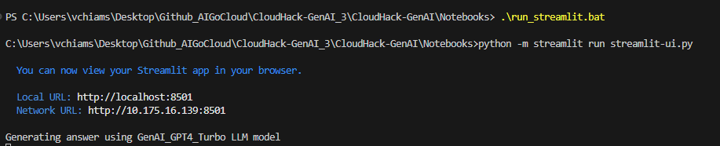
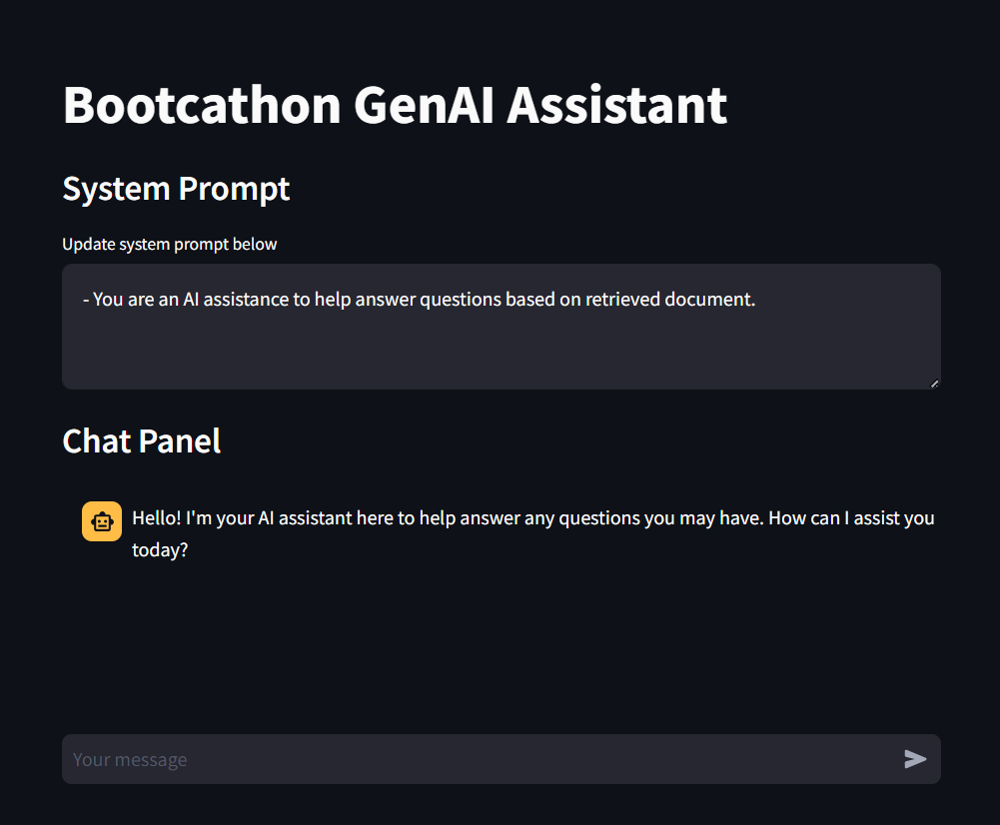
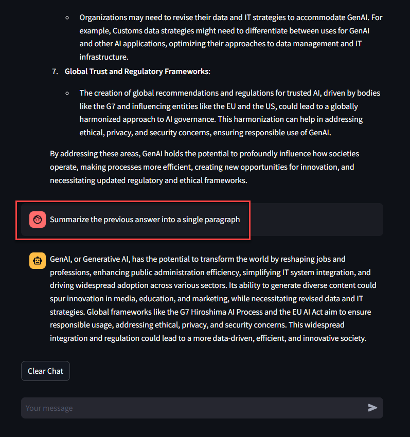

# Challenge 4: Implement chat with your data web page using Streamlit

[< Previous Challenge](./Challenge-03.md) - **[Home](../README.md)** - [Next Challenge >](./Challenge-05.md)

## Introduction
In this challenge, you will learn how to leverage [streamlit](https://streamlit.io/) as chat web page to interact with Azure OpenAI model and Azure AI search index you created.

Streamlit is an open-source Python library that enables developers to create web apps for non web developer with ease. Using Streamlit, you can quickly turn data scripts into interactive web apps with only a few lines of code. This has made Streamlit a popular choice for machine learning engineers and data scientists who want to showcase their models and interact with them through a user interface (UI).

One interesting application of Streamlit is to create a user interface for a Retrieval-Augmented Generation (RAG) model. RAG is a framework that combines the dense passage retrieval (for documents) with a transformer-based neural network generator (for creating responses). This model is particularly well-suited for building intelligent AI agents or chatbots that provide informative answers by retrieving relevant information from a large repository and generating human-like text based on that information.

## Description
1. To run the streamlit web page, navigate to `/Notebooks` folder, then run the command `.\run_streamlit.bat`
   

2. You will see the brower popup as below example
   

3. Try to ask the same set of questions and interact with different Azure OpenAI chat models. Compare the results between GPT3.5 Turbo, GPT4Turbo and GPT4o model.
4. Try to ask follow up questions or ask the model to summarize the long answer from the previous questions.
   
5. Try to ask the questions on topics that are not relevant to the documents you uploaded in the earlier challenges, and observe the answers.

   
## Success Criteria
- Succesfully run streamlit chat web page and interact with Azure OpenAI model.
- Explore and observe the model output based on different type of questions.

## Learning Resource
- [What is Streamlit?](https://streamlit.io/)
- [Azure OpenAI Code of Conduct](https://learn.microsoft.com/en-us/legal/cognitive-services/openai/code-of-conduct)

[< Previous Challenge](./Challenge-03.md) - **[Home](../README.md)** - [Next Challenge >](./Challenge-05.md)
