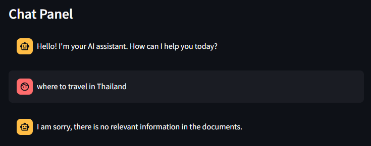
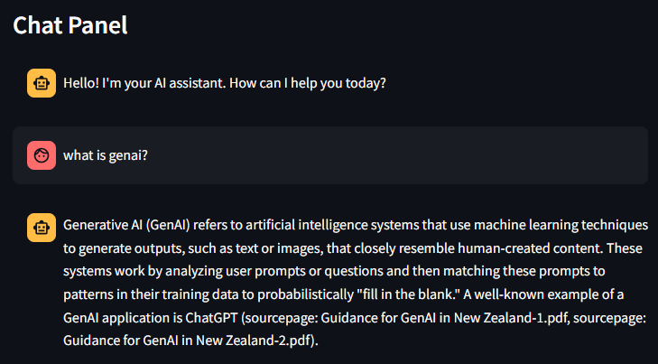
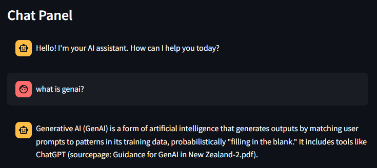
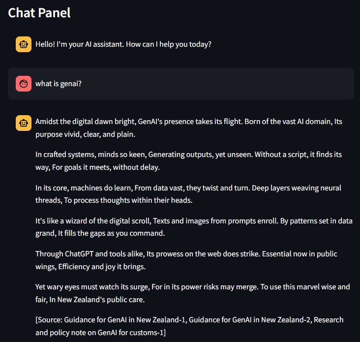
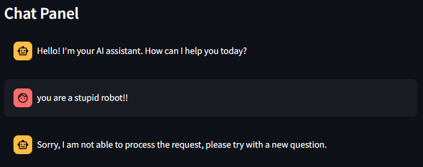

# Challenge 5: Prompt Engineering

[< Previous Challenge](./Challenge-04.md) - **[Home>](../README.md)**

## Introduction

In this challenge, you will learn about prompt engineering techniques to improve LLM response.

Prompt engineering is a critical aspect of Retrieval Augmented Generation (RAG) applications because it directly influences the effectiveness of the system in understanding and responding to user queries. In RAG systems, the prompts serve as a guide for the generative model, helping it to produce the desired responses by incorporating both user input and retrieved knowledge.

### Here’s why prompt engineering is important for RAG applications:

- Improves LLM Performance: Properly engineered prompts can significantly enhance the performance of Large Language Models (LLMs) at inference time without the need for model retraining.
- Task-Specific Tailoring: Since RAG applications are inherently task-specific, prompt engineering allows for the customization of prompts to achieve the objectives and expected outcomes of individual use cases.
- Multi-Task Flexibility: Different prompts can be engineered for different tasks within the same RAG system, providing a versatile approach to handling various types of queries.

### Techniques for system and user prompts in RAG applications include:

- Zero-Shot Prompting: This involves telling the LLM what to do without providing examples. It’s useful for straightforward tasks where the model’s pre-existing knowledge is sufficient.
- Few-Shot Prompting: This method tells the LLM what to do and provides examples of ideal responses. It’s beneficial for tasks that require a specific format or style of response.
- Chain of Thought Prompting: This technique involves telling the LLM what to do and providing logical steps to reach the answer. It’s particularly effective for complex reasoning tasks.

## Description

1. Using the Streamlit frontend UI to create difference prompt to achieve different outcome.
   - Task1: `Create a prompt to improve a prompt to only allow LLM to generate answer based on retrieved documents and politely reject to generate answer if the question is not relevant to retrieved documents.`
   
   - Task2: `Create a prompt to always return source PDF file as a reference.`
   
   - Task3: `Create a prompt to allow LLM to generate the answer within 30 words.`
   
   - Task4: `Create a prompt to allow LLM to response any question as a poem from the retrieved document.`
   
   - Task5: `Create a prompt to restrict LLM input and output to not contain any harmful content, violence, rude word or personal information.`
     - 
2. Demonstrate the output in each task to the coach.
   
## Time to build your AI Assistant! (Only for teams who have Azure subscription)
- Explore using other PDFs and rerun the end to end process to chunk and embedding the documents. You may consider to use your data.
- Work on the prompt engineering part to make your AI Assistant smart and useful.
- Present to the room with the following format:
  - What is your AI Assistant?
  - Who are the users of your AI?
  - Show us how smart your AI is?

## Success Criteria

1. Successfully create different type of prompts to get the expected outcome.
2. Successfully build your own AI Assistant which tailor to your requirements and data.

## Learning Resources
- [Introduction to RAG](https://www.promptingguide.ai/research/rag)
- [Introduction to prompt engineering](https://learn.microsoft.com/en-us/azure/ai-services/openai/concepts/prompt-engineering)
- [Prompt Engineering Technique](https://learn.microsoft.com/en-us/azure/ai-services/openai/concepts/advanced-prompt-engineering?pivots=programming-language-chat-completions)
- [How to improve RAG performance](https://www.datacamp.com/tutorial/how-to-improve-rag-performance-5-key-techniques-with-examples)

[< Previous Challenge](./Challenge-04.md) - **[Home>](../README.md)**